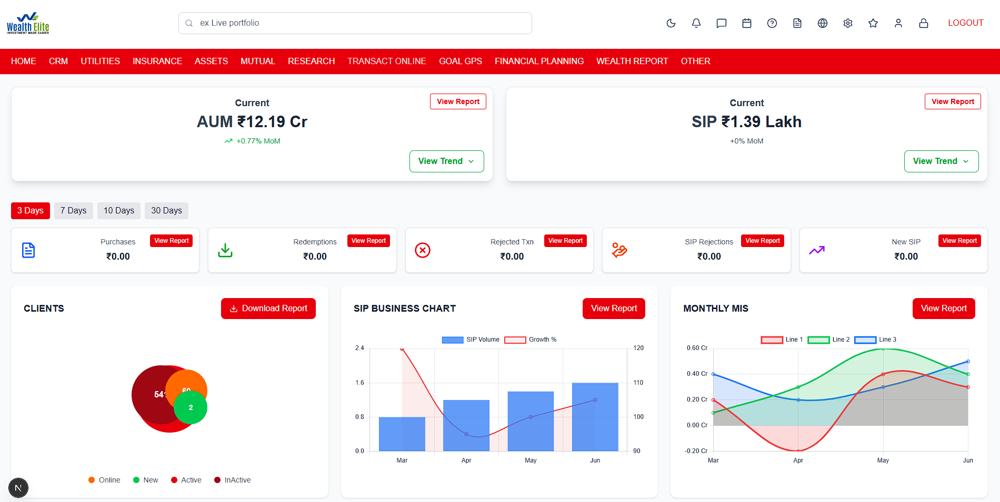

# PPY Technologies Frontend Assignment

This is the frontend assignment project for **PPY Technologies** built using [Next.js](https://nextjs.org/) and [Tailwind CSS](https://tailwindcss.com/).

---

## 🚀 Getting Started

Follow the steps below to run the project locally:

### 1. Clone the repository

git clone https://github.com/ghoshjoy347/PPY-Technologies-front-end-assignment.git

2. Navigate into the project folder

cd PPY-Technologies-front-end-assignment

3. Install dependencies

npm install

4. Start the development server

npm run dev

## 📸 Preview

"# PPY-Technologies-front-end-assignment-main" 
